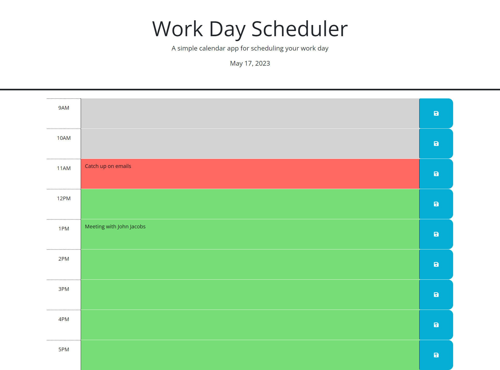

# Work-Day-Scheduler

## Description

The Work-DaySchedular is a single page front-end web application that displays time slots for a standard working day. At the top of the page is the title, description, and the current day. What follows is a display of each time slot. Each one has a text area where the user can input a task that needs to be completed and a save button to save the task to the slot. When the page is refreshed, the text remains inside the corresponding time slot.

## Usage

1. Enter a task in the schedule by clicking the colored area and typing your input.
2. Then click the save button on the right hand side to keep it in the schedule.
3. To delete or overwrite an event, simply delete or change the text and hit save.

## Technologies

* Boostrap 5.1.3
* Day.js
* Jquery

## Resources

[Deployed Link](https://zgibbs58.github.io/Calendar-App/)

[Repo Link](https://github.com/Zgibbs58/Calendar-App)

## Screen

